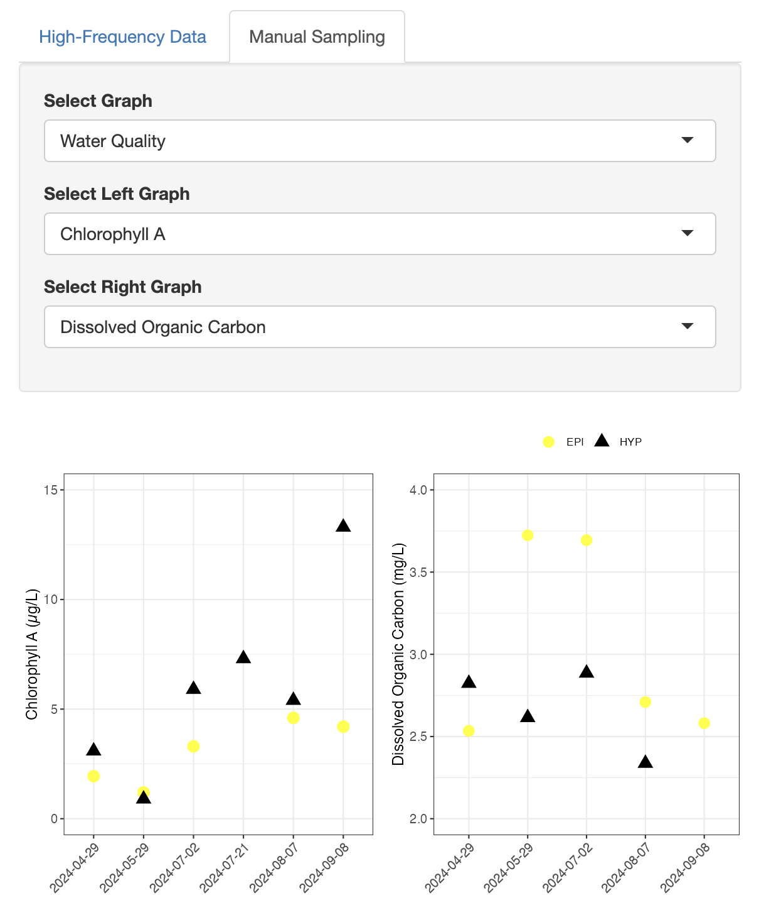

# Shiny App for Water Quality Data

This repository contains the R Shiny application for visualizing water quality data. The app provides interactive plots and user-selectable parameters for analyzing both high-frequency data and manual sampling data.



## Features

- **High-Frequency Data Tab**
    - Temperature plot
    - Heatmap plot
    - Dissolved oxygen plot

- **Manual Sampling Tab**
    - Water quality plots
    - YSI plots

- **User Inputs**
    - Date selection
    - Depth selection
    - Data frequency options

## Installation

To run the Shiny app locally, follow these steps:

1. Clone the repository:
   ```sh
   git clone https://github.com/yourusername/your-shiny-app.git
   cd your-shiny-app
   
2. Install required R packages:
   ```sh
   install.packages(c("shiny", "ggplot2", "dplyr", "tidyr", "colorRamps", "ggh4x"))
   
3. Run the app:
   ```sh
   shiny::runApp()

## Deployment

This Shiny app is integrated into a separate website for public display.
The website repository is maintained separately:

PLACEHOLDER URL